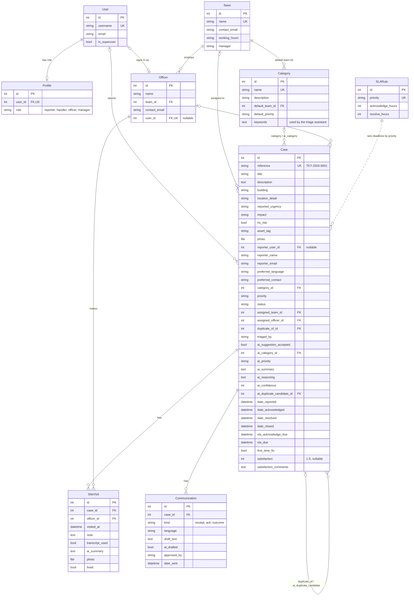

```mermaid
erDiagram
    User ||--o| Profile : "has role"
    User |o--o| Officer : "signs in as"
    User |o--o{ Case : "reports"
    Team ||--o{ Category : "default team for"
    Team ||--o{ Officer : "employs"
    Team |o--o{ Case : "assigned to"
    Category |o--o{ Case : "category / ai_category"
    Officer |o--o{ Case : "assigned to"
    Case |o--o{ Case : "duplicate_of / ai_duplicate_candidate"
    Case ||--o{ SiteVisit : "has"
    Officer ||--o{ SiteVisit : "makes"
    Case ||--o{ Communication : "has"
    SLARule ||..o{ Case : "sets deadlines by priority"

    User {
        int id PK
        string username UK
        string email
        bool is_superuser
    }
    Profile {
        int id PK
        int user_id FK, UK
        string role "reporter, handler, officer, manager"
    }
    Team {
        int id PK
        string name UK
        string contact_email
        string working_hours
        string manager
    }
    Category {
        int id PK
        string name UK
        string description
        int default_team_id FK
        string default_priority
        text keywords "used by the triage assistant"
    }
    Officer {
        int id PK
        string name
        int team_id FK
        string contact_email
        int user_id FK, UK "nullable"
    }
    SLARule {
        int id PK
        string priority UK
        int acknowledge_hours
        int resolve_hours
    }
    Case {
        int id PK
        string reference UK "TKT-2026-0001"
        string title
        text description
        string building
        string location_detail
        string reported_urgency
        string impact
        bool hs_risk
        string asset_tag
        file photo
        int reporter_user_id FK "nullable"
        string reporter_name
        string reporter_email
        string preferred_language
        string preferred_contact
        int category_id FK
        string priority
        string status
        int assigned_team_id FK
        int assigned_officer_id FK
        int duplicate_of_id FK
        string triaged_by
        bool ai_suggestion_accepted
        int ai_category_id FK
        string ai_priority
        text ai_summary
        text ai_reasoning
        int ai_confidence
        int ai_duplicate_candidate_id FK
        datetime date_reported
        datetime date_acknowledged
        datetime date_resolved
        datetime date_closed
        datetime sla_acknowledge_due
        datetime sla_due
        bool first_time_fix
        int satisfaction "1-5, nullable"
        text satisfaction_comments
    }
    SiteVisit {
        int id PK
        int case_id FK
        int officer_id FK
        datetime visited_at
        text note
        bool transcript_used
        text ai_summary
        file photo
        bool fixed
    }
    Communication {
        int id PK
        int case_id FK
        string kind "receipt, ack, outcome"
        string language
        text draft_text
        bool ai_drafted
        string approved_by
        datetime date_sent
    }
```

